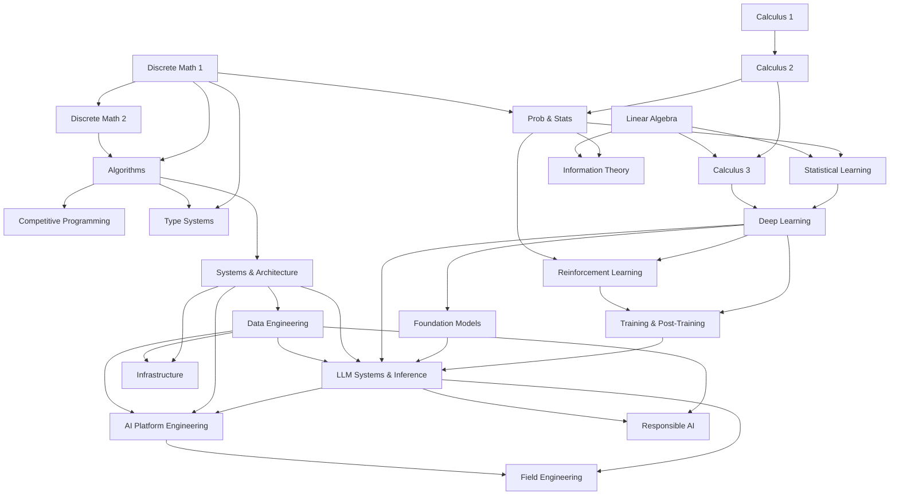

# Prerequisite Graph

```mermaid
graph TD
    C1[Calculus 1] --> C2[Calculus 2]
    C2 --> C3[Calculus 3]
    LA[Linear Algebra] --> C3
    D1[Discrete Math 1] --> D2[Discrete Math 2]
    C2 --> PS[Prob & Stats]
    D1 --> PS

    D1 --> ALG[Algorithms]
    D2 --> ALG
    ALG --> CP[Competitive Programming]

    D1 --> PL[Type Systems]
    ALG --> PL

    PS --> SL[Statistical Learning]
    LA --> SL
    SL --> DL[Deep Learning]
    C3 --> DL
    DL --> RL[Reinforcement Learning]
    PS --> RL
    DL --> FM[Foundation Models]
    DL --> TPT[Training & Post-Training]
    RL --> TPT
    TPT --> LLM

    PS --> IT[Information Theory]
    LA --> IT

    ALG --> SYS[Systems & Architecture]
    SYS --> DE[Data Engineering]
    FM --> LLM[LLM Systems & Inference]
    DL --> LLM
    SYS --> LLM
    DE --> LLM

    SYS --> INFRA[Infrastructure]
    DE --> INFRA

    LLM --> AIP[AI Platform Engineering]
    LLM --> FE[Field Engineering]
    AIP --> FE
    DE --> RAI[Responsible AI]
    LLM --> RAI
    SYS --> AIP
    DE --> AIP
```
